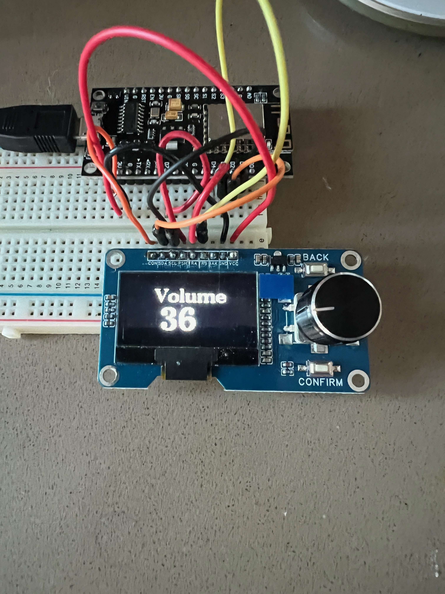
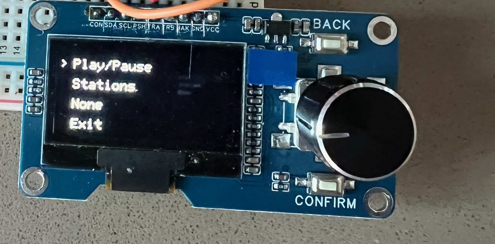

# Sonos ESP8266 Controller 

A rotary encoder-based Sonos speaker controller with OLED display for ESP8266.

## What It Does

- Controls volume for multiple Sonos speakers simultaneously
- Displays current volume on OLED screen
- Allows independent volume offset adjustment for dining room speaker
- Rotary encoder interface for volume control
- Menu system (accessible via button press)
- I wanted to achieve minimal latency, I'm controlling the speaker directly via HTTP. More scalable approach would be
-    to use Home Assistant and connect via MQTT


<p align="center">
  
  
</p>

## Hardware

### Board
- **ESP8266** (NodeMCU or similar)
- https://www.amazon.com/HiLetgo-Internet-Development-Wireless-Micropython/dp/B010O1G1ES/

### Components
- **OLED Display**: SH1106 128x64 I2C
- **Rotary Encoder**: KY-040 or similar with push button
- https://www.amazon.com/dp/B0DMYQHM9J

### Pin Connections

| Component | ESP8266 Pin | Description |
|-----------|-------------|-------------|
| OLED SDA | D2 (GPIO4) | I2C Data |
| OLED SCL | D1 (GPIO5) | I2C Clock |
| Encoder CLK | D3 (GPIO0) | Encoder A |
| Encoder DT | D4 (GPIO2) | Encoder B |
| Encoder SW | D7 (GPIO13) | Push Button |

## Development Environment Setup

### PlatformIO (Recommended)

1. Install [PlatformIO](https://platformio.org/install)
2. Open project folder in VS Code with PlatformIO extension
3. The `platformio.ini` should contain:
```ini
[env:nodemcuv2]
platform = espressif8266
board = nodemcuv2
framework = arduino
lib_deps = 
    olikraus/U8g2@^2.35.9
```
4. Build and upload: `pio run --target upload`

### Arduino IDE

1. Install [Arduino IDE](https://www.arduino.cc/en/software)
2. Add ESP8266 board support:
   - File → Preferences → Additional Board Manager URLs
   - Add: `http://arduino.esp8266.com/stable/package_esp8266com_index.json`
3. Install ESP8266 board: Tools → Board → Boards Manager → Search "ESP8266"
4. Install U8g2 library: Sketch → Include Library → Manage Libraries → Search "U8g2"
5. Select board: Tools → Board → ESP8266 Boards → NodeMCU 1.0
6. Upload via USB

## Configuration Required

Before uploading, modify these settings in `main.cpp`:

### 1. WiFi Credentials
```cpp
const char* ssid = "YOUR_WIFI_SSID";
const char* password = "YOUR_WIFI_PASSWORD";
```

### 2. Sonos Speaker IP Addresses
```cpp
const char* speakers[] = {"192.168.1.XXX", "192.168.1.XXX"};
```
Find your Sonos speaker IPs in the Sonos app under Settings → System → About My System.

### 3. Speaker Count (if different)
```cpp
const int speakerCount = 2;  // Change if you have more/fewer speakers
```

### 4. Pin Assignments (if using different pins)
```cpp
#define PIN_A D3    // Encoder CLK
#define PIN_B D4    // Encoder DT
#define PIN_SW D7   // Encoder button
```

And I2C pins in setup():
```cpp
Wire.begin(D2, D1);  // SDA, SCL
```

## Usage

- **Rotate encoder**: Adjust volume (±2 per click)
- **Single press**: Enter dining room offset adjustment mode
- **Press again**: Open menu (currently placeholder)
- **Press in menu**: Exit to main screen

### Dining Room Offset
Allows the dining room speaker to play at a different volume relative to the kitchen speaker. Automatically returns to main screen after 3 seconds of inactivity.

## Dependencies

Install via PlatformIO or Arduino IDE:
- ESP8266WiFi
- ESP8266HTTPClient
- U8g2lib (OLED library)
- Wire (I2C)

## Notes

- Volume changes are applied in increments of 2
- When kitchen volume reaches 0, the dining room offset is reset
- The controller uses Sonos UPnP API over HTTP (port 1400)
